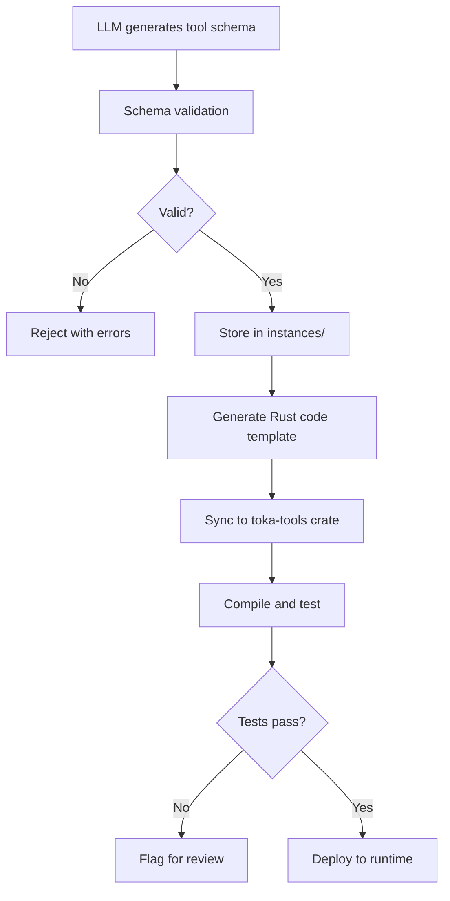

# Toka LLM System Architecture

This document defines the clean architecture for the `.llm` directory and its integration with `toka-tools`.

## 🎯 **Core Principle**

The `.llm` directory should provide **minimal, well-scoped context** for ANY LLM to understand the Toka system. Nothing more, nothing less.

## 🏗️ **Clean Architecture**

```
.llm/
├── schemas/                    # GENERAL schemas only (what things CAN be)
│   ├── agent.json             # General agent schema
│   ├── tool.json              # General tool schema  
│   ├── policy.json            # General policy schema
│   ├── contract.json          # General contract schema
│   └── resource-envelope.json # Universal envelope schema
├── instances/                 # SPECIFIC instances (what things ARE)
│   ├── agents/               # Specific agent instances
│   ├── policies/             # Specific policy instances
│   ├── contracts/            # Specific contract instances
│   └── examples/             # Example instances for LLM reference
├── validation/               # Schema validation tools
│   ├── validate.py          # Strict schema validator
│   ├── generate.py          # Schema-compliant generator
│   └── rules.json           # Validation rules
└── integration/             # Integration with toka-tools
    ├── sync.py              # Sync validated tools to toka-tools
    ├── bridge.json          # Bridge configuration
    └── mapping.json         # Schema to Rust mapping
```

## 📋 **Schema Separation**

### **General Schemas** (`schemas/`)
These define the **structure** of what agents, tools, policies can be:

```json
// schemas/agent.json - What ANY agent must look like
{
  "$schema": "http://json-schema.org/draft-07/schema#",
  "title": "Agent Schema",
  "type": "object",
  "required": ["metadata", "spec"],
  "properties": {
    "metadata": { "$ref": "#/definitions/metadata" },
    "spec": {
      "type": "object",
      "required": ["capabilities", "objectives", "constraints"],
      "properties": {
        "capabilities": { "$ref": "#/definitions/capabilities" },
        "objectives": { "type": "array", "items": { "type": "string" } },
        "constraints": { "$ref": "#/definitions/constraints" }
      }
    }
  }
}
```

### **Specific Instances** (`instances/`)
These are **concrete implementations** of those schemas:

```json
// instances/agents/tool-builder-agent.json
{
  "metadata": {
    "name": "tool-builder-agent",
    "version": "1.0.0",
    "description": "Builds and validates tools according to schema"
  },
  "spec": {
    "capabilities": ["code-generation", "schema-validation", "file-operations"],
    "objectives": [
      "Generate valid tool schemas",
      "Validate tool implementations",
      "Sync tools to toka-tools crate"
    ],
    "constraints": {
      "security": "sandbox",
      "memory": "512MB",
      "timeout": "5m"
    }
  }
}
```

## 🔧 **Tool Integration Strategy**

### **Problem Resolution**
1. **Eliminate duplicate tool systems** - Python tools are development helpers only
2. **Single source of truth** - `toka-tools` crate for production tools
3. **Schema-driven generation** - LLMs generate to schema, validation prevents invalid output
4. **Clean integration path** - Validated schemas sync to Rust implementations

### **Integration Flow**



## 📊 **Validation System**

### **Strict Schema Validation**
```python
# validation/validate.py
class SchemaValidator:
    def validate_agent(self, agent_json: dict) -> ValidationResult:
        """Validate agent against general agent schema"""
        
    def validate_tool(self, tool_json: dict) -> ValidationResult:
        """Validate tool against general tool schema"""
        
    def validate_policy(self, policy_json: dict) -> ValidationResult:
        """Validate policy against general policy schema"""
        
    def reject_invalid(self, result: ValidationResult) -> None:
        """Strictly reject invalid schemas with detailed errors"""
```

### **LLM Generation Guardrails**
```json
// validation/rules.json
{
  "agent_generation": {
    "max_capabilities": 10,
    "required_fields": ["name", "version", "capabilities", "objectives"],
    "forbidden_capabilities": ["root-access", "network-unrestricted"]
  },
  "tool_generation": {
    "max_memory": "1GB",
    "max_timeout": "10m",
    "required_security": ["sandbox", "capability-restricted"]
  }
}
```

## 🔗 **Integration with toka-tools**

### **Bridge System**
```python
# integration/sync.py
class TokaToolsBridge:
    def sync_validated_tool(self, tool_schema: dict) -> SyncResult:
        """
        1. Take validated tool schema
        2. Generate Rust code template in toka-tools
        3. Create proper Cargo.toml entries
        4. Generate tests and validation
        5. Flag for human review if complex
        """
        
    def generate_rust_template(self, tool_schema: dict) -> str:
        """Generate Rust implementation template from schema"""
        
    def update_tool_registry(self, tool_name: str) -> None:
        """Update toka-tools registry with new tool"""
```

### **Rust Code Generation**
```rust
// Auto-generated in toka-tools from schema
#[derive(Debug, Clone)]
pub struct GeneratedTool {
    name: String,
    capabilities: Vec<Capability>,
    security: SecuritySpec,
}

impl Tool for GeneratedTool {
    // Implementation generated from schema
}
```

## 🎯 **Scoped .llm Directory**

### **What .llm Should Contain**
1. **General schemas** - Define structure of agents/tools/policies
2. **Key examples** - Reference implementations for LLMs
3. **Validation tools** - Ensure LLM output is valid
4. **Integration bridge** - Sync to production systems
5. **Date enforcement** - Prevent hallucination

### **What .llm Should NOT Contain**
1. **Production tools** - These belong in `toka-tools`
2. **Duplicate implementations** - Single source of truth
3. **Complex business logic** - Keep schemas simple and focused
4. **Legacy scripts** - Clean separation from production

## 🔒 **Validation & Security**

### **Schema Compliance**
- Every LLM-generated resource MUST validate against general schemas
- Invalid resources are REJECTED with detailed error messages
- No "best effort" parsing - strict compliance only

### **Security Constraints**
- Tools cannot request unlimited capabilities
- Memory/timeout limits enforced at schema level
- Sandbox requirements built into general schemas
- Network access strictly controlled

### **Integration Safety**
- Generated Rust code is templated only
- Human review required for complex tools
- Test coverage required before deployment
- Capability validation at runtime

## 📋 **Migration Plan**

### **Phase 1: Clean Schemas** (Week 1)
1. Create clean general schemas (agent.json, tool.json, policy.json)
2. Move specific instances to instances/ directory
3. Remove schema sprawl and duplication

### **Phase 2: Validation System** (Week 2)
1. Implement strict schema validator
2. Add LLM generation guardrails
3. Test with existing instances

### **Phase 3: Integration Bridge** (Week 3)
1. Build sync system to toka-tools
2. Generate Rust templates from schemas
3. Test integration flow

### **Phase 4: Cleanup** (Week 4)
1. Remove duplicate Python tools
2. Update documentation
3. Validate complete system

## 🎉 **Benefits**

### **For LLMs**
- Clear, minimal context
- Strict schemas prevent invalid output
- Examples guide generation
- Fast validation feedback

### **For Developers**
- Single source of truth in toka-tools
- Type-safe Rust implementations
- Clean integration path
- No tool sprawl

### **For System**
- Consistent tool architecture
- Security by design
- Performance and reliability
- Maintainable codebase

---

**Core Principle**: The `.llm` directory provides **schema definitions and validation** for LLM interaction, while `toka-tools` provides the **production implementation**. Clean separation, strict validation, seamless integration. 