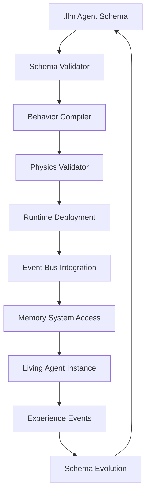

# Toka Architecture Research: Schema-Driven Living Agents

**Research Date**: 2025-07-07 
**Scope**: Deep dive analysis of Rust codebase for schema-driven transformation  
**Goal**: Evaluate shifting to minimal Rust substrate with dynamic agent composition

## 🔍 **Current Architecture Analysis**

### **Codebase Scope**
- **28 Rust crates** across distributed system components
- **Core domains**: Runtime, Orchestration, Storage, Security, Tools, Agent Management
- **Architecture**: Multi-layered with kernel enforcement and capability-based security

### **Current Agent Model**
```rust
// Current: Static, hardcoded agent definitions
pub struct AgentConfig {
    metadata: AgentMetadata,
    spec: AgentSpecConfig,
    capabilities: AgentCapabilities,
    objectives: Vec<AgentObjective>,
    tasks: AgentTasks,
    dependencies: AgentDependencies,
    reporting: ReportingConfig,
    security: SecurityConfig,
}
```

**Characteristics**:
- **Static configuration** loaded from TOML files
- **Hardcoded lifecycle** management in `AgentProcessManager`
- **Fixed capability** validation in `CapabilityValidator`
- **Predetermined task** execution patterns

## 🧬 **Living Agent Vision**

### **Conceptual Shift**
Transform from **static configurations** to **living entities** that:

1. **Exist dynamically** in the runtime environment
2. **Compose behaviors** from primitive operations
3. **Evolve capabilities** based on experience and context
4. **Communicate** through the event bus nervous system
5. **Maintain state** in working/long-term memory
6. **Operate within** Rust-enforced physics laws

### **Schema-Driven Definition**
```json
// Future: Dynamic, schema-driven agent essence
{
  "essence": {
    "identity": "research-agent-42",
    "purpose": "Explore and synthesize information",
    "personality": {
      "curiosity": 0.9,
      "persistence": 0.8,
      "collaboration": 0.7
    }
  },
  "capabilities": {
    "core": ["think", "observe", "communicate", "remember"],
    "learned": ["web-search", "code-analysis", "synthesis"],
    "emergent": []
  },
  "memory": {
    "working": {"capacity": "512MB", "retention": "1h"},
    "longterm": {"storage": "persistent", "indexing": "semantic"}
  },
  "physics_constraints": {
    "energy": {"max": "1.0 CPU-hours/day"},
    "space": {"max": "1GB memory"},
    "time": {"max": "24h continuous operation"}
  }
}
```

## ⚡ **Current System Strengths**

### **1. Event Bus as Nervous System**
```rust
// Already well-designed for living agents
pub enum KernelEvent {
    TaskScheduled { agent: EntityId, task: TaskSpec, timestamp: DateTime<Utc> },
    AgentSpawned { parent: EntityId, spec: AgentSpec, timestamp: DateTime<Utc> },
    ObservationEmitted { agent: EntityId, data: Vec<u8>, timestamp: DateTime<Utc> },
    AgentTerminated { agent: EntityId, reason: TerminationReason, exit_code: i32, timestamp: DateTime<Utc> },
    // ... more lifecycle events
}
```

**Strengths**:
- ✅ **Broadcast architecture** supports emergent communication patterns
- ✅ **Event-driven** design naturally supports reactive agents
- ✅ **Timestamped events** provide causal ordering
- ✅ **Extensible event types** can support new agent behaviors

### **2. Capability-Based Security as Physics Laws**
```rust
// Natural foundation for agent physics constraints
pub struct CapabilityValidator {
    declared_capabilities: HashSet<String>,
    security_config: SecurityConfig,
    available_tools: Vec<String>,
}
```

**Strengths**:
- ✅ **Capability enforcement** already acts as physics constraints
- ✅ **Resource limits** (memory, CPU, timeout) are enforced
- ✅ **Sandbox isolation** provides safe agent environments
- ✅ **Tool access control** limits what agents can do

### **3. Storage as Memory Systems**
```rust
// Multiple storage backends for different memory types
- MemoryStorage    // Working memory (fast, volatile)
- FileStorage      // Long-term memory (persistent)
- SemanticStorage  // Associative memory (indexed)
- SqliteStorage    // Structured memory (queryable)
```

**Strengths**:
- ✅ **Multiple storage types** map to different memory systems
- ✅ **Causal hashing** provides memory integrity
- ✅ **Event sourcing** enables memory reconstruction
- ✅ **Semantic indexing** supports associative recall

### **4. Runtime Execution Engine**
```rust
// Dynamic code execution with caching
pub async fn execute_code(&self, request: ExecutionRequest) -> Result<ExecutionResult> {
    // Validation, caching, execution, monitoring
}
```

**Strengths**:
- ✅ **Multi-language support** (Rust, Python, JavaScript, WASM)
- ✅ **Code caching** for performance optimization
- ✅ **Execution monitoring** for resource tracking
- ✅ **Security enforcement** during execution

## 🔄 **Hardcoded Logic to Collapse**

### **1. Agent Lifecycle Management**
**Current**: Hardcoded in `AgentProcessManager`
```rust
// Rigid lifecycle: Configured -> Ready -> Spawning -> Active -> Completed/Failed
pub enum AgentState {
    Configured, Ready, Spawning, Active, Paused, Completed, Failed,
}
```

**Schema-Driven Alternative**:
```json
{
  "lifecycle": {
    "states": ["dormant", "awakening", "active", "learning", "resting", "evolving"],
    "transitions": {
      "dormant -> awakening": {"trigger": "task_assigned", "conditions": ["resources_available"]},
      "active -> learning": {"trigger": "experience_threshold", "conditions": ["reflection_time"]},
      "learning -> evolving": {"trigger": "insight_gained", "conditions": ["capability_unlocked"]}
    }
  }
}
```

### **2. Task Execution Patterns**
**Current**: Hardcoded task assignment and execution
```rust
// Static task assignment from configuration
for task_config in &agent_config.tasks.default {
    let task = TaskSpec::new(task_config.description.clone())?;
    // Schedule task...
}
```

**Schema-Driven Alternative**:
```json
{
  "behavior_patterns": {
    "exploration": {
      "when": "curiosity > 0.7 && new_environment",
      "actions": ["observe", "catalog", "hypothesize"]
    },
    "collaboration": {
      "when": "task_complexity > capability && other_agents_available",
      "actions": ["broadcast_request", "negotiate_roles", "coordinate"]
    }
  }
}
```

### **3. Capability Validation**
**Current**: Static capability checking
```rust
// Hardcoded capability validation
pub fn can_perform(&self, capability: &str) -> Result<bool> {
    let has_capability = self.declared_capabilities.contains(capability);
    // ...
}
```

**Schema-Driven Alternative**:
```json
{
  "capability_evolution": {
    "learning_rules": {
      "observe_and_practice": {
        "input": "repeated_exposure + successful_execution",
        "output": "capability_strength += 0.1"
      },
      "teaching_others": {
        "input": "explain_capability + successful_transfer",
        "output": "capability_mastery += 0.2"
      }
    }
  }
}
```

### **4. Dependency Resolution**
**Current**: Static dependency graphs
```rust
// Hardcoded dependency resolution
pub fn resolve_spawn_order(&self, agents: &[String]) -> Result<Vec<String>> {
    // Topological sort of static dependencies
}
```

**Schema-Driven Alternative**:
```json
{
  "dynamic_relationships": {
    "collaboration_patterns": {
      "research_synthesis": ["data_gatherer", "analyst", "synthesizer"],
      "code_development": ["architect", "implementer", "tester", "reviewer"]
    },
    "emergence_rules": {
      "when": "task_complexity > individual_capability",
      "action": "form_collaboration_cluster"
    }
  }
}
```

## 🏗️ **Minimal Rust Substrate Design**

### **Core Primitives to Preserve**
```rust
// Essential physics laws that cannot be violated
pub enum PhysicsLaw {
    // Resource constraints
    EnergyConservation { max_cpu: f64, max_memory: usize },
    // Security boundaries  
    CapabilityBoundary { allowed: CapabilitySet },
    // Temporal constraints
    CausalOrdering { event_precedence: EventOrder },
    // Information flow
    CommunicationProtocol { bus: EventBus },
}

// Minimal agent substrate
pub struct AgentSubstrate {
    identity: EntityId,
    physics: PhysicsConstraints,
    memory: MemoryInterface,
    communication: EventBusInterface,
    execution: RuntimeInterface,
}

// Schema interpreter
pub struct SchemaInterpreter {
    schema_validator: SchemaValidator,
    behavior_compiler: BehaviorCompiler,
    capability_manager: CapabilityManager,
    lifecycle_engine: LifecycleEngine,
}
```

### **Dynamic Composition Engine**
```rust
// Runtime behavior composition from schemas
pub struct BehaviorComposer {
    primitives: PrimitiveRegistry,
    patterns: PatternLibrary,
    constraints: PhysicsEngine,
}

impl BehaviorComposer {
    pub async fn compose_behavior(
        &self,
        agent_schema: &AgentSchema,
        context: &RuntimeContext,
    ) -> Result<ComposedBehavior> {
        // 1. Validate schema against physics laws
        self.constraints.validate_schema(agent_schema)?;
        
        // 2. Compile behavior patterns from schema
        let behaviors = self.compile_behaviors(agent_schema)?;
        
        // 3. Optimize for current context
        let optimized = self.optimize_for_context(behaviors, context)?;
        
        // 4. Return executable behavior
        Ok(optimized)
    }
}
```

## 📊 **Tradeoff Analysis**

### **Benefits of Schema-Driven Approach**

#### **🟢 Advantages**
1. **Dynamic Adaptation**: Agents can evolve without code changes
2. **Emergent Behaviors**: Complex behaviors emerge from simple rules
3. **Rapid Experimentation**: New agent types via schema changes
4. **Reduced Maintenance**: Less hardcoded logic to maintain
5. **LLM Integration**: Natural fit for LLM-generated agent definitions
6. **Scalability**: Schema validation prevents resource exhaustion
7. **Composability**: Mix and match behaviors dynamically

#### **🔴 Risks & Challenges**
1. **Performance Overhead**: Schema interpretation vs compiled code
2. **Debugging Complexity**: Harder to trace dynamic behaviors
3. **Security Concerns**: Dynamic behavior composition attack surface
4. **Validation Complexity**: Ensuring schema correctness at runtime
5. **Migration Effort**: Significant refactoring of existing codebase
6. **Learning Curve**: New paradigm for developers

### **Pragmatic Implementation Strategy**

#### **Phase 1: Hybrid Approach** (3 months)
- Keep existing Rust implementations as fallbacks
- Add schema interpretation layer alongside hardcoded logic
- Implement schema validation and basic behavior composition
- Migrate non-critical agents to schema-driven approach

#### **Phase 2: Core Migration** (6 months)  
- Migrate core agent types to schema-driven implementation
- Implement advanced behavior composition patterns
- Add capability evolution and learning systems
- Performance optimization and monitoring

#### **Phase 3: Full Schema-Driven** (9 months)
- Remove hardcoded agent implementations
- Implement emergent behavior patterns
- Add agent-to-agent learning and teaching
- Production deployment and monitoring

## 🎯 **Recommended Architecture**

### **Layered Design**
```
┌─────────────────────────────────────┐
│        .llm Schema Layer            │  ← Agent definitions, behaviors, constraints
├─────────────────────────────────────┤
│     Schema Interpretation Layer     │  ← Validate, compile, optimize schemas
├─────────────────────────────────────┤
│       Behavior Composition Layer    │  ← Compose behaviors from primitives
├─────────────────────────────────────┤
│        Physics Enforcement Layer    │  ← Rust-enforced constraints & security
├─────────────────────────────────────┤
│          Runtime Substrate          │  ← Event bus, memory, execution engine
└─────────────────────────────────────┘
```

### **Schema-to-Runtime Flow**


### **Integration with .llm Directory**
```
.llm/
├── schemas/
│   ├── agent.json              # General agent structure
│   ├── behavior.json           # Behavior pattern definitions
│   ├── capability.json         # Capability evolution rules
│   └── physics.json            # Physics constraint definitions
├── instances/
│   ├── agents/                 # Living agent definitions
│   ├── behaviors/              # Reusable behavior patterns
│   └── experiments/            # Experimental agent configurations
├── validation/
│   ├── validate.py             # Schema validation
│   ├── physics_check.py        # Physics constraint validation
│   └── behavior_test.py        # Behavior pattern testing
└── runtime/
    ├── deploy.py               # Deploy schemas to runtime
    ├── monitor.py              # Monitor living agents
    └── evolve.py               # Manage agent evolution
```

## 🚀 **Next Steps**

### **Immediate Actions** (Week 1)
1. **Create behavior schema** definitions in `.llm/schemas/`
2. **Implement basic schema interpreter** in Rust
3. **Add physics constraint validation** layer
4. **Prototype simple schema-driven agent**

### **Short Term** (Month 1)
1. **Migrate one agent type** to schema-driven approach
2. **Implement behavior composition engine**
3. **Add schema evolution mechanisms**
4. **Performance baseline and optimization**

### **Medium Term** (Months 2-3)
1. **Migrate core agent types** to schemas
2. **Implement emergent behavior patterns**
3. **Add agent learning and adaptation**
4. **Production deployment pipeline**

## 🎉 **Conclusion**

The Toka codebase is **exceptionally well-positioned** for this transformation:

- **Event bus** already functions as a nervous system
- **Capability system** provides natural physics constraints  
- **Storage layers** map directly to memory systems
- **Runtime engine** supports dynamic execution

The shift to **schema-driven living agents** is not just feasible but **architecturally aligned** with the existing design. The key is **gradual migration** with **hybrid coexistence** during the transition.

**Recommendation**: Proceed with **Phase 1 hybrid approach** to validate the concept while maintaining system stability. The potential for **emergent intelligence** and **dynamic adaptation** far outweighs the implementation complexity.

---

*This research provides the foundation for transforming Toka from a static agent orchestration system into a dynamic ecosystem of living, evolving agents operating within Rust-enforced physics laws.* 