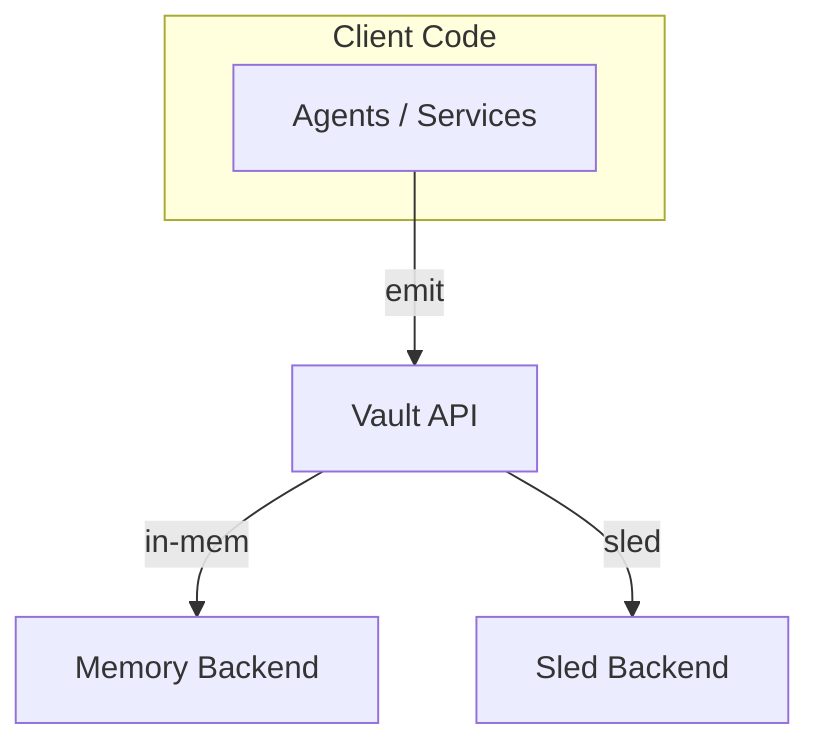

# Event System Consolidation – `toka-vault` (v0.2.0-alpha)

This guide documents the **great vault consolidation** that replaced every specialised bus/ledger crate with a single, canonical event store: **`toka-vault`**.

> Historical note: prior to v0.2 we maintained multiple crates (`toka-events-core`, `toka-bus-memory`, `toka-bus-persist`, …). They have been **retired**. If you are looking at an old commit, consult the previous revision of this file.

---

## 1  Architecture at a Glance



* `Vault API` – Thin façade offering **commit**, **subscribe**, and **replay**.
* _Back-ends_ – Implement the same `EventStore` trait.
  * **Memory** (default): blazing-fast, non-durable, ideal for tests.
  * **Sled** (`persist-sled`): embedded, crash-safe database.

### Why consolidate?

1. **Less Cognitive Load** – One crate, one API surface.
2. **Fewer Dependencies** – No more duplicate event types across crates.
3. **Clear Ownership** – All event semantics live together.

---

## 2  Key Concepts

| Term | Description |
|------|-------------|
| **EventHeader** | Immutable metadata (`id`, `kind`, `timestamp`, `parents`). |
| **EventPayload** | Any `serde::Serialize` type – stored by Blake3 hash. |
| **Vault** | Enum that wraps concrete back-ends. |
| **EventStore** | Async trait implemented by each back-end. |

---

## 3  Using the Vault

Add a dependency:

```toml
[dependencies]
toka-vault = { version = "0.1", features = ["persist-sled"] }
```

Basic flow:

```rust
use toka_vault::{Vault, SledVault};

#[tokio::main]
async fn main() -> anyhow::Result<()> {
    let vault = Vault::Sled(SledVault::open("./events.db")?);

    // commit an event (no parents)
    let header = vault.commit_json("system.start", serde_json::json!({ "pid": 1234 }), &[]).await?;

    // later… subscribe to a live stream
    let mut rx = vault.subscribe();
    if let Some(evt) = rx.recv().await? {
        println!("{} -> {:?}", evt.header.kind, evt.payload);
    }

    Ok(())
}
```

---

## 4  Intent Clustering – _Deferred_

Semantic grouping of events ("intent clustering") **is not implemented in v0.2**. We stashed the `intent-cluster` feature flag as a placeholder so the eventual public API is reserved, but enabling it right now does **nothing**.

Design explorations will happen in a dedicated branch before merging back into main. Contributions are welcome – open a discussion first so we can align on goals & constraints.

---

## 5  Testing Matrix

| Command | Back-end | Notes |
|---------|----------|-------|
| `cargo test -p toka-vault` | Memory | default run, no features |
| `cargo test -p toka-vault --features persist-sled` | Sled | needs writable FS |

CI executes both rows on every PR.

---

## 6  Migration Guide (from legacy crates)

| Legacy API | Replacement |
|------------|-------------|
| `MemoryEventBus` | `Vault::Memory` |
| `PersistentEventBus` | `Vault::Sled` |
| `EventHeader` (old path) | `toka_vault::EventHeader` |
| `DomainEvent` | any `serde::Serialize` payload |

A typical migration looks like this:

```diff
-use toka_bus_memory::{MemoryEventBus, EventBus};
-
-let bus = MemoryEventBus::new_default();
-bus.emit_domain_event(event, "my-service").await?;
+use toka_vault::{Vault, InMemoryVault};
+
+let vault = Vault::Memory(InMemoryVault::new(1024)?);
+vault.commit_json("my.event", &payload, &[]).await?;
```

---

## 7  Future Work

1. Distributed back-ends (gRPC, Redis, Kafka).
2. Projection helpers for CQRS patterns.
3. Formalise the intent clustering research & implementation.

---

Happy hacking!
