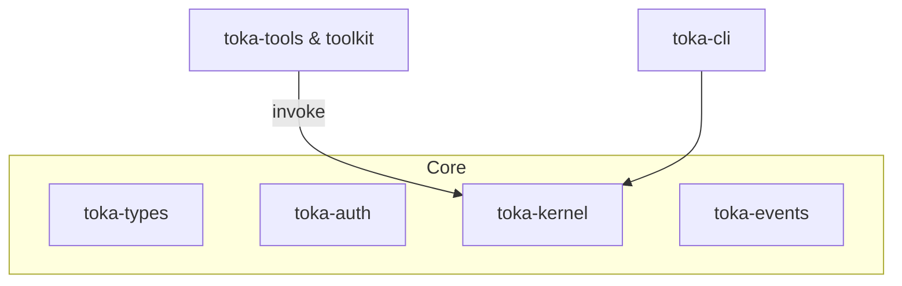

# Toka OS – Agentic Operating System (v0.1)

> **Status:** Early preview & architectural prototype.  Expect rapid iteration until the v0.1 milestone is finalised.

Toka OS is an **agent–centric**, capability‐secured runtime built in Rust.  It aims to offer a minimal yet expressive foundation for autonomous agents to **perceive**, **reason**, and **act** within secure boundaries.

Key design pillars:

1. **Deterministic Kernel** – `toka-kernel` executes signed `Operation`s against an in-memory `WorldState`, emitting rich domain events.
2. **Capability-Based Security** – `toka-auth` verifies fine-grained capability tokens on every kernel invocation.
3. **Unified Type System** – `toka-types` exports common IDs, time-stamps, and envelope types leveraged by every crate.
4. **Event-Sourced Persistence** – `toka-events` stores an append-only log of kernel events to guarantee auditability and replay.
5. **Pluggable Tools & WASM** – `toka-tools` + `toka-toolkit-core` provide a sandbox for custom, versioned tools (native or WASM).
6. **Developer CLI** – `apps/toka-cli` offers an ergonomic interface for interacting with the runtime and scaffolding new projects.

All first-party crates are `#![forbid(unsafe_code)]` and strictly audited for third-party dependencies (see `/SECURITY.md`).

---

## Workspace Crates (2025-07)

| Crate | Purpose |
|-------|---------|
| **toka-kernel** | Deterministic state-machine core; validates capability claims & dispatches `Operation`s. |
| **toka-types** | Shared primitives (`EntityId`, `Operation`, envelopes, timestamps). |
| **toka-events** | Canonical event store & typed event bus. |
| **toka-auth** | Capability token issuance & verification (HS256 JWT β). |
| **toka-tools** | Standard library of agent tools (currently: `echo`). |
| **toka-toolkit-core** | Tool registry, loader abstraction, WASM helpers. |
| **toka-events-api** | Pure contracts for event handling (optional `serde` support). |
| **toka-agents** *(planned)* | Default agent implementations layered on top of the kernel. |
| **toka-cli** | Reference CLI (create agents, invoke kernel ops, inspect events). |

> *Planned:* a dedicated **`toka-agents`** crate will land before the `v0.1` tag to house reusable agent behaviours.

---

## Quick Start

```bash
# Validate build – requires stable Rust 1.78+
cargo check --workspace --all-features

# Launch CLI help
cargo run -p toka-cli -- --help
```

---

## Architecture Diagram



---

## Vision & Roadmap

Toka OS envisions a world where **autonomous agents** collaborate securely, governed by transparent capability grants and deterministic execution.  Our immediate roadmap:

- ✅ Kernel v0.1 feature-freeze (capability checks, event emission)
- ⬜ Introduce `toka-agents` crate with reference agent behaviours
- ⬜ Persist event store on disk (SQLite or Sled backend)
- ⬜ Add WASM tool execution via `wasmtime`
- ⬜ Harden documentation & examples (`cargo doc` must pass with `#![deny(missing_docs)]`)

Community contributions are welcome – see [`CONTRIBUTING.md`](CONTRIBUTING.md) for guidelines.

---

© 2025 Toka Contributors · MIT OR Apache-2.0
