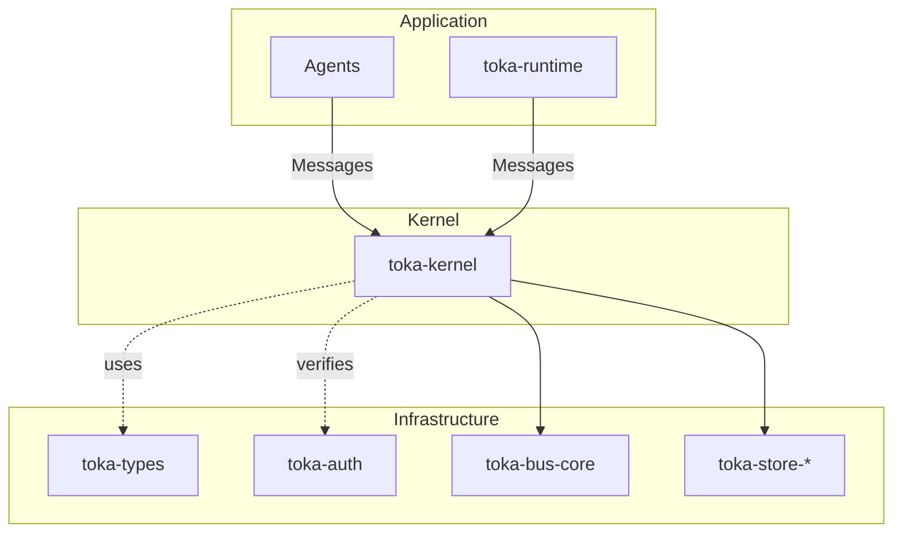

# Toka OS – **Agentic Operating System** (v0.1)

> **Status:** *v0.1 – Kernel feature-freeze*  | 🚧 **Experimental – APIs WILL break** 🚧  | *Documentation overhaul in progress*

Toka OS is an **agent-centric**, capability‐secured operating system written in Rust.  At its heart sits the deterministic [`toka-kernel`](crates/toka-kernel), a pure state-machine that applies **Operations** (opcodes) against a canonical **WorldState** and emits verifiable domain events.

The v0.1 **pure kernel** – see [`docs/42_toka_kernel_spec_v0.1.md`](docs/42_toka_kernel_spec_v0.1.md) – focuses on a **single primitive family**:

1. **Agent primitives** – task scheduling, spawning and observation hooks

Financial & user concerns are now provided by *external toolkits* that plug into the kernel via well-defined messages.  This keeps the kernel minimal, deterministic and audit-friendly.

Everything above the kernel (storage back-ends, networking, finance, user management) is intentionally out of scope for 0.1 and ships in accessory crates.

# Vision

Toka's long-term goal is a **self-contained Agentic OS** where autonomous programs collaborate, transact and evolve within cryptographically enforced boundaries.  Economic primitives are first-class citizens: every resource is account-ed, every capability is explicit, and every state transition is transparently logged.

Key design pillars:

| Pillar | Manifestation |
|--------|--------------|
| **Determinism** | Single-threaded kernel → same input, same output |
| **Capability security** | `toka-auth` validates unforgeable permission tokens |
| **Event sourcing** | Pluggable storage backends (`toka-store-*`) enable replay & audits |
| **Extensibility** | New opcodes are additive – no breaking removals |
| **Minimal surface** | Everything non-essential (storage, WASM, networking) lives outside the kernel |

# Workspace Overview (July 2025)

| Crate | Status | Purpose |
|-------|--------|---------|
| **toka-types** | ✅ | Shared primitives (`EntityId`, `Operation`, etc.) |
| **toka-kernel** | ✅ | Deterministic state-machine core |
| **toka-bus-core** | ✅ | Lightweight event broadcasting |
| **toka-store-core** | ✅ | Storage backend abstractions |
| **toka-auth** | ✅ | Capability token issuance & validation |
| **toka-tools** | ✅ | Core tool abstractions **+** standard reference tools |
| **toka-agents** | ⬜ *planned* | Default agent implementations layered atop the kernel |
| **toka-runtime** | ✅ | Async coordination layer bridging kernel and storage |

> Legend: ✅ implemented 🟡 minimal / WIP ⬜ missing

# Quick Start

```bash
# Validate build – requires stable Rust 1.78+
cargo check --workspace --all-features

# Run tests to see the kernel in action
cargo test --workspace --all-features
```



## Roadmap (towards v0.1 stable)

| Phase | Goal | Target Date |
|-------|------|------------|
| **K-1** | Kernel v0.1 feature-freeze (done) | 2025-06-30 ✅ |
| **A-1** | Land `toka-agents` crate with default behaviours | ⬜ 2025-07-15 |
| **S-1** | Persist event store on disk (SQLite & RocksDB adapters) | ⬜ 2025-07-30 |
| **W-1** | WASM tool execution via `wasmtime` | ⬜ 2025-08-10 |
| **D-1** | Harden documentation & examples (`cargo doc` must pass `#![deny(missing_docs)]`) | 🟡 rolling |

> The full roadmap lives in [`docs/ROADMAP.md`](docs/ROADMAP.md).

© 2025 Toka Contributors · Apache-2.0
