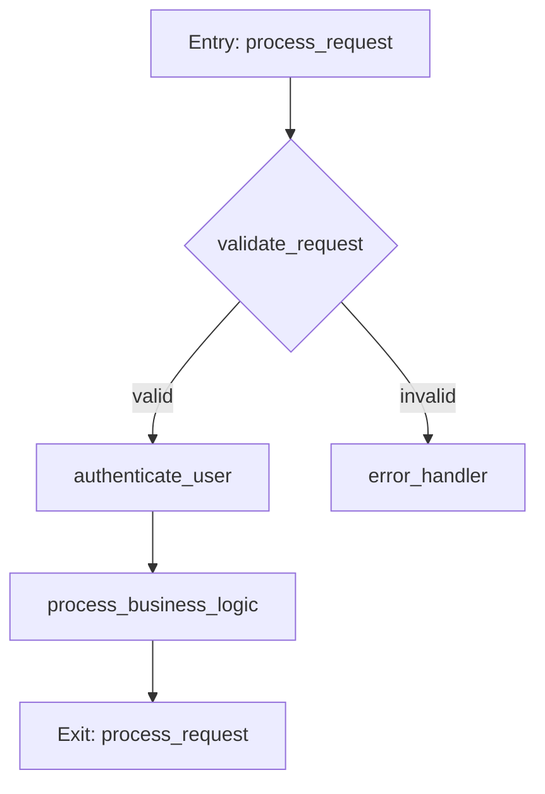

# Toka Analysis Tools

**Hardened, production-ready code analysis and visualization tools for the Toka agentic OS**

[](https://www.python.org/downloads/)
[](https://opensource.org/licenses/Apache-2.0)
[](https://github.com/psf/black)

## Overview

The Toka Analysis Tools provide comprehensive code analysis and visualization capabilities specifically designed for the Toka agentic operating system. These tools have been cleaned up, hardened, and integrated with modern development workflows including Cursor IDE via Model Context Protocol (MCP).

### Key Features

- 🔍 **Control Flow Analysis**: Deep analysis of Rust function control flows with async/await pattern detection
- 📊 **Dependency Visualization**: Comprehensive dependency mapping and architecture visualization
- 🎨 **Multiple Output Formats**: Mermaid diagrams, interactive HTML, JSON exports, and textual summaries
- 🔌 **MCP Integration**: Direct integration with Cursor and other MCP-compatible editors
- 🎯 **GitHub-Friendly**: Mermaid diagrams render natively in GitHub for seamless documentation
- 📱 **Interactive Web**: Responsive visualizations that work on desktop, tablet, and mobile
- 🛠️ **CLI & API**: Both command-line and programmatic interfaces
- 🏗️ **Toka Integration**: Native registration as tools in the Toka agent system

## Installation

### Basic Installation

```bash
pip install -e .
```

### With MCP Support (for Cursor integration)

```bash
pip install -e .[mcp]
```

### Development Installation

```bash
pip install -e .[dev]
```

## Quick Start

### Command Line Usage

```bash
# Analyze control flow for a specific function
toka-analysis control-flow --function process_request --formats mermaid json summary

# Analyze workspace dependencies
toka-analysis dependency --formats mermaid interactive

# Run combined analysis
toka-analysis combined

# List available tools
toka-analysis list-tools
```

### MCP Server for Cursor

```bash
# Start MCP server for Cursor integration
toka-analysis mcp-server --stdio
```

Then add to your Cursor MCP configuration:

```json
{
  "mcpServers": {
    "toka-analysis": {
      "command": "toka-analysis",
      "args": ["mcp-server", "--stdio"],
      "env": {
        "TOKA_WORKSPACE_PATH": "/path/to/your/toka/workspace"
      }
    }
  }
}
```

### Programmatic Usage

```python
import asyncio
from toka_analysis_tools import ControlFlowAnalyzer, DependencyAnalyzer

async def analyze_workspace():
    # Control flow analysis
    cf_analyzer = ControlFlowAnalyzer("/path/to/workspace")
    await cf_analyzer.analyze_workspace()
    
    # Dependency analysis  
    dep_analyzer = DependencyAnalyzer("/path/to/workspace")
    await dep_analyzer.analyze_workspace()
    
    print(f"Found {len(cf_analyzer.function_flows)} functions")
    print(f"Found {len(dep_analyzer.crates)} crates")

asyncio.run(analyze_workspace())
```

## Architecture

The Toka Analysis Tools follow a clean, modular architecture:

```
toka_analysis_tools/
├── __init__.py              # Package initialization and exports
├── config.py               # Configuration management
├── control_flow.py         # Control flow analysis engine
├── dependency_graph.py     # Dependency analysis engine
├── tool_registry.py        # Tool registration for Toka system
├── mcp_server.py          # MCP server for Cursor integration
└── cli.py                 # Command-line interface
```

### Core Principles

- **Security First**: All inputs are validated, no unsafe operations
- **Clear Documentation**: Every public API is documented with intent and usage
- **Simplicity Over Complexity**: Solve problems with the simplest effective solution
- **Modularity**: Clear separation between analysis, visualization, and integration
- **Type Safety**: Full type hints for better IDE support and error catching

## Features in Detail

### Control Flow Analysis

- **Rust-Specific Patterns**: Detects async/await, error handling, state machines
- **Complexity Metrics**: Cyclomatic complexity, async complexity, error handling complexity
- **Multiple Visualizations**: Mermaid flowcharts, interactive graphs, PNG/SVG exports
- **LLM-Friendly Output**: Structured JSON and markdown summaries for AI consumption

### Dependency Analysis

- **Crate Mapping**: Analyzes Cargo.toml files across workspace
- **Agent Composition**: Maps agent specifications and capabilities
- **Architecture Views**: Layered architecture, component interactions, complexity heatmaps
- **Multi-Format Export**: Mermaid, JSON, interactive HTML, textual summaries

### Integration Capabilities

- **Toka Tool Registration**: Native integration with Toka's tool system
- **MCP Server**: Full Model Context Protocol support for Cursor
- **GitHub Integration**: Mermaid diagrams render directly in GitHub
- **Web-Ready**: Interactive visualizations work across devices

## Configuration

### Environment Variables

```bash
export TOKA_WORKSPACE_PATH="/path/to/workspace"
export TOKA_OUTPUT_DIR="analysis_output"
export TOKA_MAX_COMPLEXITY=15
export TOKA_LOG_LEVEL="INFO"
```

### Configuration File

Create `analysis_config.toml`:

```toml
[analysis_tools]
workspace_path = "/path/to/workspace"
output_dir = "analysis_output"
max_complexity_threshold = 15
enable_mermaid = true
enable_interactive = true

[analysis_tools.security]
sandbox_enabled = true
max_memory = "512MB"
max_cpu = "0.5"
timeout = "1800"
```

## Output Formats

### Mermaid Diagrams

Perfect for GitHub documentation:



### Interactive HTML

Responsive, zoomable, filterable visualizations with:
- Infinite zoom and pan
- Node filtering by type
- Multiple layout algorithms
- Live complexity metrics
- Mobile-friendly design

### JSON Export

Structured data perfect for LLM consumption:

```json
{
  "function_name": "process_request",
  "complexity_metrics": {
    "cyclomatic_complexity": 8,
    "async_complexity": 3,
    "error_handling_complexity": 5
  },
  "nodes": [...],
  "edges": [...],
  "analysis_summary": "..."
}
```

## Integration with Toka

The tools integrate seamlessly with the Toka agentic OS:

### Tool Registration

```rust
// Tools are automatically registered in the Toka system
let registry = register_toka_tools(config);
```

### Agent Specification

```toml
[[agents]]
name = "analysis-tools"
domain = "code-analysis"
priority = "medium"

[agents.capabilities]
primary = [
    "control-flow-analysis",
    "dependency-analysis", 
    "code-visualization"
]
```

## Examples

### Analyze a Specific Function

```bash
toka-analysis control-flow \
  --function handle_user_request \
  --formats mermaid json summary interactive
```

Output:
- `handle_user_request.mmd` - Mermaid flowchart
- `handle_user_request.json` - Structured data
- `handle_user_request_summary.md` - Human-readable analysis
- `handle_user_request_interactive.html` - Interactive visualization

### System Architecture Analysis

```bash
toka-analysis dependency \
  --formats mermaid json summary interactive
```

Generates comprehensive dependency analysis including:
- System-wide dependency graph
- Component interaction patterns
- Agent composition analysis
- Layered architecture visualization

### MCP Integration with Cursor

1. Start the MCP server:
```bash
toka-analysis mcp-server --stdio
```

2. In Cursor, use prompts like:
- "Analyze the authentication flow in the system"
- "Review the dependency structure for potential issues"
- "Analyze the complexity of the handle_request function"

## Performance

- **Parallel Processing**: Multi-threaded analysis for large codebases
- **Incremental Analysis**: Only re-analyze changed files
- **Memory Efficient**: Streaming processing for large dependency graphs
- **Fast Startup**: Optimized initialization and caching

## Development

### Running Tests

```bash
pytest tests/
```

### Code Quality

```bash
# Format code
black toka_analysis_tools/

# Sort imports
isort toka_analysis_tools/

# Type checking
mypy toka_analysis_tools/

# Linting
flake8 toka_analysis_tools/
```

### Contributing

1. Follow the Rust coding standards adapted for Python
2. Add type hints for all public APIs
3. Document all functions and classes
4. Write tests for new functionality
5. Ensure code passes all quality checks

## Roadmap

- [ ] **Enhanced Rust Analysis**: Support for more Rust-specific patterns
- [ ] **Performance Metrics**: Integration with profiling data
- [ ] **Security Analysis**: Detect security patterns and vulnerabilities
- [ ] **Custom Visualizations**: User-defined visualization templates
- [ ] **Real-time Analysis**: Live analysis during development
- [ ] **Team Collaboration**: Shared analysis results and annotations

## Support

- **Issues**: [GitHub Issues](https://github.com/ScrappyAI/toka/issues)
- **Documentation**: [Toka Documentation](https://github.com/ScrappyAI/toka)
- **Community**: Join the Toka community discussions

## License

Licensed under the Apache License, Version 2.0. See [LICENSE](LICENSE-APACHE) for details.

---

**Built with ❤️ for the Toka agentic OS**