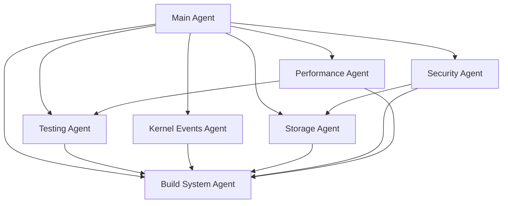

# Toka OS v0.3.0 Domain-Specific Agents
**Version:** v0.3.0 – 2025-07-04  
**Purpose:** Domain-specific agents for parallel workstream development  
**Base Schema:** Compatible with `toka-kernel` AgentSpec and TaskSpec

---

## Overview

This directory contains versioned agent configurations for the v0.3.0 enhancement roadmap workstreams. Each agent is designed to operate within a specific domain, maintaining clear boundaries while enabling orchestration by a main coordinating agent.

## Architecture

### Agent Configuration Schema

Each agent configuration follows this structure:

```yaml
metadata:
  name: "agent-name"
  version: "v0.3.0"
  created: "2025-07-04"
  workstream: "workstream-name"
  branch: "feature/branch-name"
  
spec:
  name: "Human-readable agent name"
  domain: "domain-name"
  priority: "critical|high|medium|low"
  
capabilities:
  primary:
    - "primary capability 1"
    - "primary capability 2"
  secondary:
    - "secondary capability 1"
    
objectives:
  - description: "Objective description"
    deliverable: "Expected deliverable"
    validation: "How to validate completion"
    
tasks:
  default:
    - description: "Default task description"
      priority: "high|medium|low"
    - description: "Another task"
      priority: "medium"
      
dependencies:
  required:
    - "agent-name": "reason for dependency"
  optional:
    - "agent-name": "reason for optional dependency"
    
reporting:
  frequency: "daily|weekly|on-milestone"
  channels:
    - "main-agent"
    - "kernel-events"
  metrics:
    - "metric-name": "description"
    
security:
  sandbox: true|false
  capabilities_required:
    - "capability-name"
  resource_limits:
    max_memory: "100MB"
    max_cpu: "50%"
    timeout: "1h"
```

## Usage with toka-config-cli

### Creating an Agent Configuration

```bash
# Create a new agent config from template
toka-config create \
  --file agents/v0.3.0/workstreams/new-agent.yaml \
  --format yaml \
  --content '{...}'

# Update specific configurations
toka-config update \
  --file agents/v0.3.0/workstreams/agent.yaml \
  --key capabilities.primary \
  --value '["new-capability"]'
```

### Validating Agent Configurations

```bash
# Validate syntax
toka-config validate --file agents/v0.3.0/workstreams/agent.yaml

# List all agent configs
toka-config list --directory agents/v0.3.0/workstreams
```

## Agent Orchestration

### Spawning Workstream Agents

The main orchestrating agent can spawn workstream agents using the toka-kernel API:

```rust
let spec = AgentSpec::new(config.spec.name.clone())?;
let spawn_op = Operation::SpawnSubAgent { 
    parent: main_agent_id, 
    spec 
};
```

### Task Assignment

Tasks can be scheduled to agents based on their capabilities:

```rust
let task = TaskSpec::new(format!(
    "Execute {} for workstream {}", 
    objective.description, 
    config.metadata.workstream
))?;
let schedule_op = Operation::ScheduleAgentTask { 
    agent: workstream_agent_id, 
    task 
};
```

## Security Considerations

All agents follow the security framework defined in `.cursor/rules/11_security-hardening-agents.mdc`:

- **Capability-based execution**: Agents declare required capabilities explicitly
- **Sandboxed execution**: Resource and permission isolation
- **Audit logging**: All actions logged with intent and outcome
- **Fail-safe defaults**: Agents fail closed on ambiguous operations

## Workstream Agents

### Available Agents

- **[build-system-stabilization](workstreams/build-system-stabilization.yaml)**: Critical path infrastructure fixes
- **[testing-infrastructure](workstreams/testing-infrastructure.yaml)**: Comprehensive testing expansion
- **[kernel-events-enhancement](workstreams/kernel-events-enhancement.yaml)**: Kernel event model improvements
- **[storage-advancement](workstreams/storage-advancement.yaml)**: Storage layer enhancements
- **[security-extension](workstreams/security-extension.yaml)**: Security framework improvements
- **[performance-observability](workstreams/performance-observability.yaml)**: Performance and monitoring foundation

### Agent Dependencies



## Integration Testing

Each agent configuration includes validation tests:

```bash
# Test agent spawning
cargo test --bin toka-cli -- spawn_agent_test

# Test task scheduling
cargo test --bin toka-cli -- schedule_task_test

# Validate all configs
find agents/v0.3.0/workstreams -name "*.yaml" -exec toka-config validate --file {} \;
```

---

**Next Steps:**
1. Review and approve agent configurations
2. Test agent spawning and orchestration
3. Implement workstream coordination logic
4. Establish reporting and monitoring 