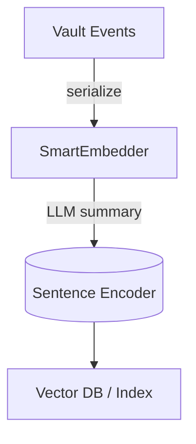

# Smart Embedder

_LLM-powered summarisation + embedding generation for events in **Toka Vault**_

---

## Motivation

After the [event system consolidation](../../EVENT_SYSTEM_REFACTOR.md) every actionable fact in the platform flows through the `toka-vault` event store.  `smart-embedder` turns those **structured events** into dense vectors so that agents and tools can:

* run semantic search over millions of historical events,
* cluster related intents for higher-level reasoning,
* build recommendation or anomaly-detection pipelines.

---

## High-level Architecture



1. **Summarise** – An LLM condenses the raw JSON payload into a single sentence.
2. **Encode** – A sentence embedding model converts the summary into a fixed-dimensional vector.
3. **Store / Search** – Your choice of index (not included here) makes the vectors queryable.

Both steps are abstracted behind traits so you can plug in OpenAI, local `llama.cpp`, `rust-bert`, etc.

---

## Feature Flags

| Feature | Adds | Heavy deps |
|---------|------|-----------|
| *(none)* | Trait definitions only | – |
| `openai` | Simple OpenAI-compatible client | `reqwest` |
| `transformers` | Local BERT-based encoder via `rust-bert` | `rust-bert`, `ndarray` |

Keep your dependency graph **lean** by enabling only what you need.

---

## Example

```rust,no_run
use smart_embedder::{openai_client::OpenAiClient, transformer_encoder::BertEncoder, SmartEmbedder};

#[tokio::main]
async fn main() -> anyhow::Result<()> {
    let llm = OpenAiClient::new(std::env::var("OPENAI_API_KEY")?, "https://api.openai.com".into());
    let encoder = BertEncoder::new()?;
    let embedder = SmartEmbedder::new(llm, encoder);

    let event_kind = "agent.action";
    let payload = serde_json::json!({"agent_id": "agnt_…", "action": "echo"});
    let vec = embedder.embed_event(event_kind, &payload).await?;
    println!("Vector dim = {}", vec.len());
    Ok(())
}
```

---

## Roadmap

* v0.2 – Benchmarks + SIMD quantisation
* v0.3 – Intent clustering research integration (when the design stabilises)

---

## License

Apache-2.0 OR MIT

© 2024 Toka Contributors 