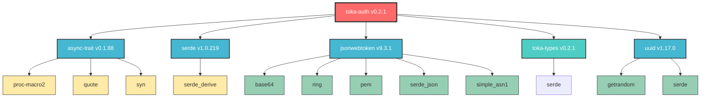
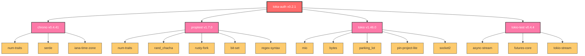

# Toka Auth Dependency Graph

This document provides a visual representation of the dependency tree for the `toka-auth` crate.

## Overview

The `toka-auth` crate is responsible for authentication and authorization functionality within the Toka ecosystem. It leverages several key dependencies to provide secure, async-compatible authentication services.

## Main Dependencies

## Development Dependencies

## Dependency Categories

### Core Authentication Dependencies
- **jsonwebtoken**: JWT token handling and validation
- **ring**: Cryptographic primitives for secure operations
- **base64**: Base64 encoding/decoding for token formats
- **pem**: PEM format handling for certificates and keys
- **simple_asn1**: ASN.1 parsing for cryptographic data structures

### Serialization & Data Handling
- **serde**: Serialization and deserialization framework
- **serde_json**: JSON serialization support
- **uuid**: UUID generation and handling

### Async Support
- **async-trait**: Enables async functions in traits
- **tokio**: Async runtime (dev dependency)
- **tokio-test**: Testing utilities for async code

### Development & Testing
- **chrono**: Date and time handling for testing
- **proptest**: Property-based testing framework
- **tokio-test**: Async testing utilities

### Internal Dependencies
- **toka-types**: Internal type definitions shared across Toka crates

## Key Features Enabled

1. **JWT Authentication**: Complete JWT token lifecycle management
2. **Async Compatibility**: Full async/await support through async-trait
3. **Secure Cryptography**: Ring-based cryptographic operations
4. **Flexible Serialization**: Serde-based data transformation
5. **Comprehensive Testing**: Property-based and async testing capabilities
6. **Type Safety**: Strong type safety through toka-types integration

## Architecture Notes

The dependency graph shows that `toka-auth` is designed as a secure, async-first authentication library with the following architectural decisions:

- **Cryptographic Security**: Uses `ring` for cryptographic operations, providing high-performance, secure implementations
- **Standard Compliance**: Supports industry-standard JWT tokens and PEM formats
- **Async-First Design**: Built with async/await patterns for non-blocking operations
- **Type Safety**: Leverages Rust's type system and internal type definitions for compile-time safety
- **Testing-Focused**: Extensive testing infrastructure with both unit and property-based tests

This dependency structure ensures that `toka-auth` can provide secure, efficient authentication services while maintaining compatibility with the broader Toka ecosystem.