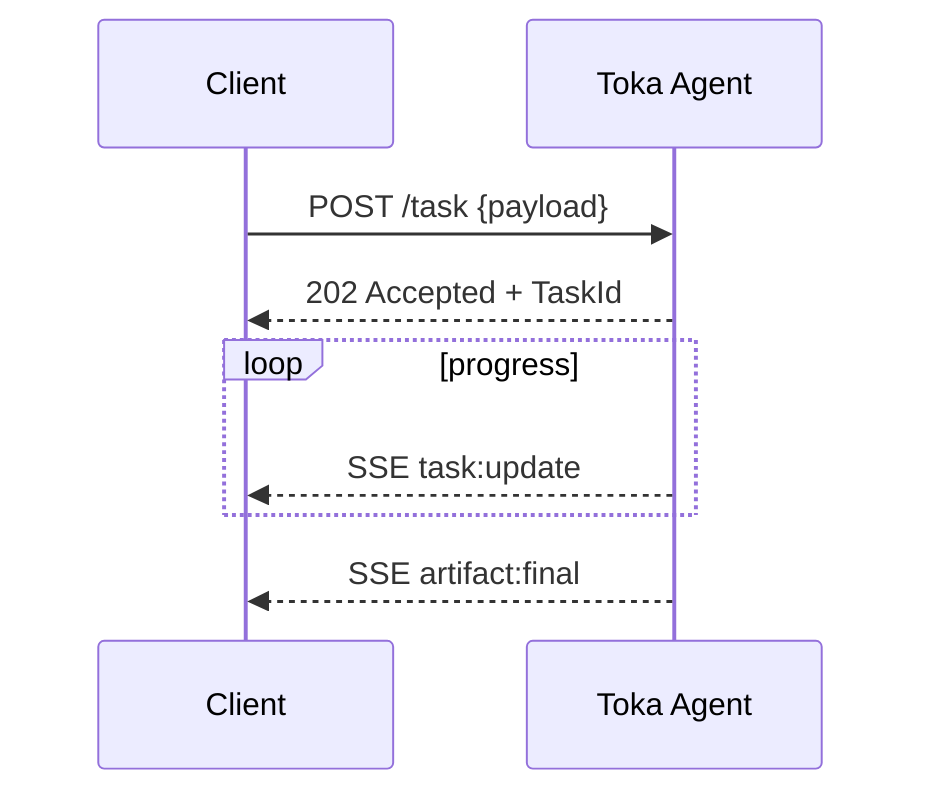

# Google Agent-to-Agent (A2A) Protocol Guidance

> Protocol: A2A v0.4-draft – see upstream site for latest spec.
>
> Local doc path: `docs/protocols/a2a_google.md`

Upstream docs:
* 📚 <https://google.github.io/A2A/>
* Spec markdown in the A2A repo – commit `6689bcf`.

---

## Core Endpoints

| Verb | Path | Function |
|------|------|----------|
| GET  | `/agent` | Serve **Agent Card** JSON |
| POST | `/task`  | Accept a Task and return TaskId (stream updates via SSE) |
| GET  | `/artifact/{id}` | Download artifact blobs |

### Minimum Agent Card Fields

```jsonc
{
  "a2a_version": "0.4-draft",
  "id": "com.toka.runtime",
  "name": "Toka Runtime",
  "description": "Reference agent host for Toka AI systems",
  "capabilities": ["tooling", "event-stream"],
  "links": {
    "icon": "https://toka.ai/icon.png",
    "documentation": "https://docs.toka.ai"
  }
}
```

## Implementation Checklist

1. Mark crate root with rustdoc banner:
   ```rust
   //! Protocol: A2A v0.4-draft (see docs/protocols/a2a_google.md)
   ```
2. Expose endpoints via Axum or Actix.
3. Validate outgoing JSON against `schemas/agent_card.json` (CI step `a2a_conformance`).
4. Stream `task_update` and `artifact` events over **SSE**.
5. Reuse OAuth2 bearer validation module from MCP layer.

## Version Policy

| A2A Spec | Status | Notes |
|----------|--------|-------|
| 0.4-draft | **current** | Expect churn until v1.0 |

## Mermaid – Task Flow



---

## Testing

```bash
cargo test --features "a2a_conformance"
``` 