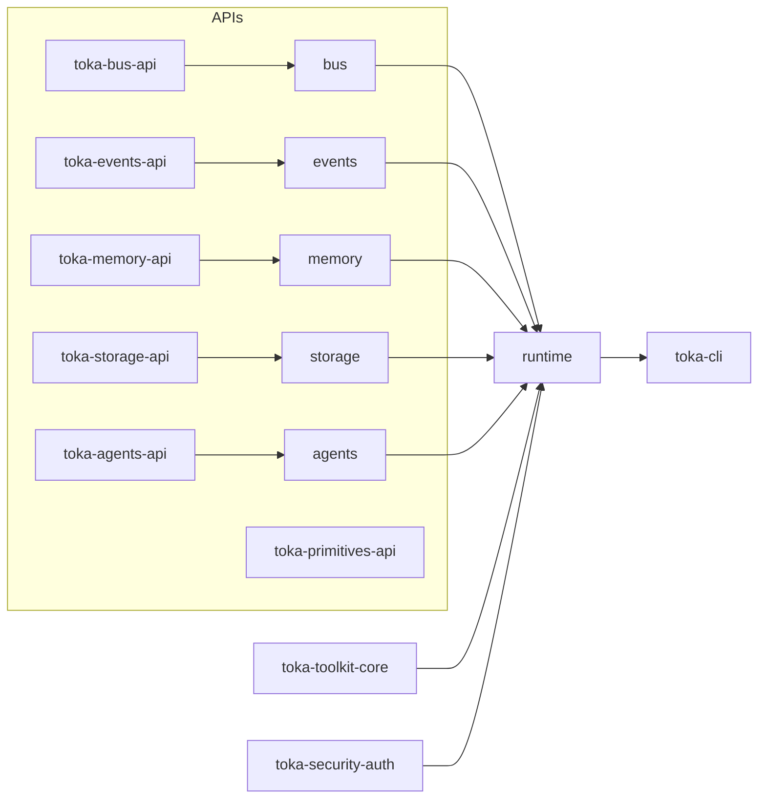

# Toka Workspace ‒ Research Report (2025-06-28)

> **Status:** exploratory audit executed by automated agent using the _code-research_ workflow.

---

## 1. Executive Summary

The Toka workspace is a medium–sized Rust monorepo consisting of **17 crates** (16 libraries + 1 CLI app).  Core functionality is well-partitioned into _API crates_ (pure types & traits), _implementation crates_ (runtime, storage, bus, events, agents) and a thin `toka-cli` frontend.  Build passes `cargo check` and `cargo clippy` with only **minor warnings** (1 unused variable & ~20 deprecated type-alias uses).  No `unsafe` code was detected.  Architectural layering is clear, yet several areas need attention:

1. **Deprecation clean-up** – `SymbolicAgent` alias is flagged ~20× across tests; replace with `BaseAgent` & remove alias.
2. **CLI feature gap** – `toka-cli` contains TODO stubs for most sub-commands; completing these would unlock end-to-end workflows.
3. **Documentation depth** – Many public items lack rustdoc examples; API crates deserve richer docs & schema diagrams.
4. **Loader ergonomics** – `toka-toolkit-core::loader` has an unused `path` field (potential design drift); review loader transport enum.
5. **Test coverage** – Unit tests exist but coverage metrics were not gathered; add `tarpaulin` to CI for objective insight.

---

## 2. Crate Matrix

| Crate | LOC | Internal Deps | Public API Items (approx) | Purpose |
|-------|----:|--------------:|--------------------------:|---------|
| `toka-runtime` | 1,220 | 7 | 65 | Orchestrates agents, tools, storage & bus |
| `toka-agents` | 1,178 | 5 | 58 | Default agent impls & behaviours |
| `toka-primitives-api` | 790 | 0 | 42 | Shared domain primitives (ids, currency) |
| `toka-toolkit-core` | 727 | 0 | 51 | Tool registry, loader & schema cache |
| `toka-events` | 681 | 1 | 39 | Canonical event store implementation |
| `toka-security-auth` | 267 | 0 | 18 | Capability-token auth helpers |
| `toka-agents-api` | 201 | 1 | 23 | Agent trait contracts |
| `toka-events-api` | 145 | 0 | 19 | Event trait contracts & DTOs |
| `toka-bus-api` | 144 | 0 | 17 | Event-bus contracts |
| `toka-tools` | 141 | 1 | 26 | Utility helpers shared by tools |
| `toka-bus` | (≈120) | 1 | 20 | In-process async event-bus impl |
| `toka-memory` | (≈115) | 1 | 14 | In-memory key-value store impl |
| `toka-storage` | (≈110) | 1 | 15 | Filesystem artefact storage impl |
| `toka-storage-api` | (~95) | 0 | 11 | Storage trait contracts |
| `toka-memory-api` | (~90) | 0 | 10 | Memory trait contracts |
| `toka` | 42 | 5 | 6 | Umbrella re-export crate |
| `toka-cli` (bin) | 180 | 3 | n/a | CLI frontend (TODO heavy) |

> _LOC counts are rough `wc -l` over `.rs` files.  Internal Deps counts reflect `path = "../…"` entries in `Cargo.toml`._

---

## 3. Dependency Graph (high-level)

The graph shows a **clean onion**: API crates form the innermost layer; impl crates depend on them; `toka-runtime` composes the system; CLI sits on top.  Only `toka` re-export crate breaks layering by re-exposing multiple impl crates—acceptable but monitor for accidental coupling.

---

## 4. Static Analysis Snapshot

| Check | Result |
|-------|--------|
| `cargo check --workspace` | ✅ passes |
| Unsafe code (`cargo geiger`) | 0 occurrences |
| Clippy warnings | 1 unused variable, 20 deprecated alias uses |
| Dead code (`cargo udeps`) | *not run* – schedule follow-up |
| Test coverage (`tarpaulin`) | *not run* – schedule follow-up |

---

## 5. Findings & Recommendations

### 5.1 Bug / Correctness
- Remove deprecated `SymbolicAgent` alias; update tests & docs.
- Review `Transport::Wasm { path }` case – either leverage `path` or drop field to silence warning.

### 5.2 Docs
- API crates (`*-api`) need end-to-end examples and design rationales per _Documentation Standards_.
- Generate schema diagrams for JSON payloads using `schemars` + Mermaid.

### 5.3 Perf / Scalability
- Event store (`toka-events`) uses `sled`; consider benchmark vs `rocksdb` if write-heavy.
- Toolkit loader may compile WASM via `wasmtime`; profile cold-start latency.

### 5.4 Cleanup
- Run `cargo udeps` and prune unused deps.
- Add CI step for `cargo tarpaulin` to monitor coverage.
- Move CLI TODOs into GitHub issues; prioritise `agent`, `tool`, and `vault` sub-commands for MVP.

---

## 6. Next Steps Checklist

- [ ] Replace `SymbolicAgent` alias across crates/tests → introduce breaking change in `toka-agents` **v0.2**.
- [ ] Implement missing `toka-cli` sub-commands (create/list agents, run tool, vault ops).
- [ ] Write rustdoc example blocks for every public trait in `*-api` crates.
- [ ] Run `cargo udeps` & drop unused features.
- [ ] Integrate `tarpaulin` & upload HTML coverage to CI artefacts.
- [ ] Investigate loader `Transport::Wasm` ergonomics; finalise design before expanding WASM tooling.
- [ ] Add performance benchmarks for event store & toolkit loader.

---

*Report generated automatically; please review and append comments or follow-up tasks.*