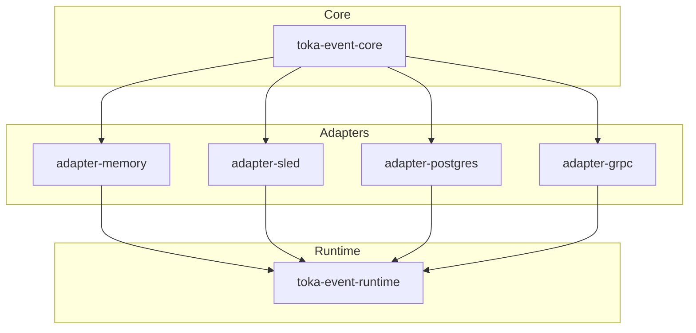

# Toka Events & Bus – Architecture Consolidation Report

> **Date:** 2025-06-30  
> **Author:** Automated Workspace Research Agent  
> **Scope:** `toka-events`, `toka-events-api`, `toka-bus`, `toka-bus-api`

---

## 1  Executive Summary

The current event & bus layer consists of four crates split between **API contracts** and **runtime implementations**:

| Crate | Layer | Purpose |
|-------|-------|---------|
| `toka-events-api` | API | *Data model* (`EventHeader`, `EventPayload`, hashing helpers) + *persistence contracts* (`EventSink`, `QueryApi`). |
| `toka-events` | Impl | Persistent (`sled`) + in-memory vault implementations; optional intent clustering. |
| `toka-bus-api` | API | Bus‐level DTOs (`BusEventHeader`, `AgentEvent`, …) & async `EventBus` trait. |
| `toka-bus` | Impl | Tokio broadcast-based, in-process bus implementation.

While the split keeps binary sizes small, it introduces *four* crates plus repeated feature-flag wiring.  Downstream consumers must juggle two separate namespaces (`events` vs `bus`) even though both describe **event propagation**.  A more cohesive architecture would:

* Expose **one canonical API crate** (no heavy deps) for *all* event primitives.  
* Offer pluggable **adapters** for storage (**Vaults**) *and* transport (**Buses**).  
* Standardise **gRPC** as the wire-level protocol for inter-process pub/sub while retaining a fast in-memory bus for local scenarios.

---

## 2  Current Issues & Risks

1. **API Proliferation** – Two "*-api" crates increase maintenance overhead, duplicated doc standards, versioning, and feature matrices.
2. **Coupling via Re-export** – `toka-events` re-exports `events-api` types, leaking implementation crates into domain code.
3. **No Standard Wire Protocol** – Tokio `broadcast` is great in-proc but cannot cross process boundaries.  Projects will inevitably invent ad-hoc bridges.
4. **Scaling Concerns** – `sled` is fine for dev; a production cluster likely needs Postgres, Kafka, NATS, or cloud pub/sub.
5. **Naming Drift** – The "*Bus*" vs "*Event*" distinction is blurry: both move event headers; only the payload destination differs.

---

## 3  Opportunity – A Unified *toka-event-core*

### 3.1  Crate Split Proposal

```
crates/
│
├─ toka-event-core    # → NEW (was ‑api crates merged)
│   ├─ no_std by default, alloc optional
│   └─ Defines: EventHeader, EventPayload, BusHeader, traits
│
├─ toka-event-adapters
│   ├─ memory          (Tokio broadcast)
│   ├─ sled            (embedded db)
│   ├─ postgres        (logical decoding / LISTEN-NOTIFY)
│   └─ grpc            (wire protocol, tonic generated)
│
└─ toka-event-runtime # orchestrates adapters, batching, retries
```

• **Core** is always dependency-light, powering WASM guests.  
• **Adapters** are opt-in via cargo features `adapter-grpc`, `adapter-postgres`, …  
• **Runtime** composes adapters + background tasks (persist → publish fan-out, retry queue, metrics).

### 3.2  gRPC Service Sketch

```proto
syntax = "proto3";
package toka.events;

message EventHeader  { /* fields mirror Rust struct */ }
message CommitReq    { EventHeader header = 1; bytes payload = 2; }
message CommitResp   {}
message SubscribeReq { repeated string kinds = 1; }

service EventStore {
  rpc Commit(CommitReq) returns (CommitResp);
  rpc Subscribe(SubscribeReq) returns (stream EventHeader);
}
```

This maps 1-to-1 to `EventSink::commit` and a streaming version of `EventBus::subscribe`.

### 3.3  In-Memory Bus Path

Keep a pure-Tokio `broadcast` adapter for tests & CLI demos.  The adapter implements the same `EventBus` trait so swapping to gRPC becomes a config change.

---

## 4  Architectural Boundaries



* **Core** stays `no_std`; **Adapters** bring `std` + deps; **Runtime** owns async tasks, metrics, and back-pressure.

---

## 5  Roadmap

| Phase | Milestone | Tasks | Breaking? |
|-------|-----------|-------|-----------|
| **0** | *Prep* | ‑ Freeze current crates; publish patch releases. | No |
| **1** | *Core Merge* | 1. Create `toka-event-core`  
  2. Move types & traits from both `*-api` crates.<br/>3. Provide re-export shims (`toka-events-api`, `toka-bus-api`) marked `#[deprecated]`. | Yes (major)|
| **2** | *Adapter Refactor* | 1. Split `toka-events` into `adapter-sled` & `adapter-memory`.  
 2. Extract hashing, clustering to separate modules under `core` features. | Minor |
| **3** | *gRPC Adapter* | 1. Define `.proto` (tonic build under `adapter-grpc`).  
 2. Provide client + server that map to core traits. | Additive |
| **4** | *Runtime Orchestration* | 1. New `toka-event-runtime` crate; spawn tasks: *persist → publish*, retries, metrics.  
 2. Deprecate direct use of adapters by app code. | Minor |
| **5** | *Deprecation Cleanup* | 1. Remove shims; delete old crates.  
 2. Bump major to `v0.3`. | Major |

*Estimated duration*: ~4–6 weeks with 2 FTE engineers.

---

## 6  Risks & Mitigations

| Risk | Impact | Mitigation |
|------|--------|-----------|
| **Breaking API churn** | Downstream crates must migrate. | Provide deprecation shims + migration guide; publish blog post. |
| **Tonic dependency bloat** | Binary size ↑, compile time ↑. | Make `adapter-grpc` optional; default build remains lean.
| **Concurrency bugs in runtime fan-out** | Data loss. | Introduce property tests and chaos test harness (kill-store, restart) before GA. |
| **Adapter explosion** | Maintenance overhead. | Enforce criteria: production usage or external PR sponsorship before new adapter lands. |

---

## 7  Next Steps

1. **Kick-off PR** – Open a draft PR adding `toka-event-core`, copying docs & tests.  
2. **RFC Review** – Circulate this report for feedback; amend phases if needed.  
3. **Assign Ownership** – Nominate *Events WG* maintainers for each phase.  
4. **Update CI** – Add matrix job building each adapter behind its feature gate.  
5. **Write Migration Guide** – `/docs/migrate_event_v0.2_to_v0.3.md` explaining type moves and feature flags.

---

> End of report – please leave inline GH comments or schedule a design-review meeting.