# Toka Agent Implementation Research & Proposal
**Date:** 2025-01-27  
**Status:** Research Complete - Implementation Proposal  
**Scope:** Core Agent Runtime Implementation for v0.3.0

## Executive Summary

After comprehensive research of the Toka codebase, I've identified a sophisticated foundation with a critical gap: while the orchestration infrastructure is robust and agent configurations are comprehensive, **there is no agent execution runtime** that can actually interpret and execute agent configurations. This proposal outlines the implementation of the missing agent execution layer to enable the first set of operational agents.

## Current State Analysis

### ✅ Strong Foundation Components

#### 1. **Core Architecture (Excellent)**
- **Kernel**: Deterministic state machine with secure capability validation
- **Runtime**: Bridges kernel with storage/events, handles persistence  
- **Types System**: Well-defined security-first primitives with validation
- **Event Bus**: Real-time event distribution with subscription model
- **Storage Layer**: Multiple backends (Memory, Sled, SQLite) with abstractions

#### 2. **Orchestration Infrastructure (Comprehensive)**
- **OrchestrationEngine**: Sophisticated agent lifecycle management
- **Dependency Resolution**: Topological sorting with priority handling
- **Configuration Loading**: YAML-based agent configs with validation
- **Progress Monitoring**: Real-time agent state tracking
- **LLM Integration**: Secure gateway with rate limiting and sanitization

#### 3. **Agent Configurations (Production-Ready)**
- **9 Configured Agents**: From build-system to performance-observability
- **Dependency Graphs**: Well-defined inter-agent dependencies
- **Security Constraints**: Sandbox, capabilities, resource limits
- **Task Definitions**: Granular objectives with priority classification
- **Status Tracking**: Phase 1 complete, Phase 2 active

#### 4. **Security Framework (Robust)**
- **Capability System**: JWT-based authentication with validation
- **Resource Limits**: Memory, CPU, timeout constraints per agent
- **Audit Logging**: Security monitoring and threat detection
- **Input Sanitization**: Protection against injection attacks

### ❌ Critical Gap: Agent Execution Runtime

**The Missing Link**: While agents can be **spawned** and **tracked** by the orchestration system, there is no runtime that can **execute** agent configurations. The current flow stops at:

```rust
// This works ✅
let spawn_result = self.runtime.submit(spawn_message).await?;

// This is missing ❌
// How does the spawned agent actually execute its tasks?
// How does it use LLM integration to accomplish objectives?
// How does it report progress back to orchestration?
```

## Architecture Gap Analysis

### Current Agent Lifecycle

```mermaid
graph LR
    A[Agent Config] --> B[Orchestration Engine]
    B --> C[Kernel Spawn]
    C --> D[Track State]
    D --> E[❌ Execution Gap]
```


### Required Agent Lifecycle  


## Implementation Proposal

### Phase 1: Core Agent Runtime (Priority: Critical)

#### 1.1 Agent Executor Framework
**Location**: `crates/toka-agent-runtime/`

```rust
/// Core agent execution runtime that interprets agent configurations
pub struct AgentExecutor {
    /// Agent configuration loaded from YAML
    config: AgentConfig,
    /// Agent entity ID from kernel spawn
    agent_id: EntityId,
    /// Runtime connection for kernel operations
    runtime: Arc<Runtime>,
    /// LLM gateway for intelligent task execution
    llm_gateway: Arc<LlmGateway>,
    /// Current execution state
    state: AgentExecutionState,
    /// Task queue and execution tracking
    task_executor: TaskExecutor,
}

impl AgentExecutor {
    /// Create new agent executor from spawned agent
    pub async fn new(
        config: AgentConfig,
        agent_id: EntityId,
        runtime: Arc<Runtime>,
        llm_gateway: Arc<LlmGateway>,
    ) -> Result<Self>;
    
    /// Main execution loop - interprets and executes agent configuration
    pub async fn run(&mut self) -> Result<()>;
    
    /// Execute a specific task with LLM assistance
    async fn execute_task(&mut self, task: TaskConfig) -> Result<TaskResult>;
    
    /// Report progress back to orchestration system
    async fn report_progress(&self, progress: AgentProgress) -> Result<()>;
}
```

#### 1.2 Task Execution Engine
**Integration Point**: Connect with existing LLM gateway

```rust
/// Executes individual tasks using LLM integration
pub struct TaskExecutor {
    llm_gateway: Arc<LlmGateway>,
    capabilities: Vec<String>,
    security_constraints: SecurityConfig,
}

impl TaskExecutor {
    /// Execute task with LLM assistance and security validation
    pub async fn execute_task(
        &self,
        task: TaskConfig,
        context: AgentContext,
    ) -> Result<TaskExecutionResult> {
        // 1. Validate task against agent capabilities
        self.validate_task_permissions(&task)?;
        
        // 2. Build LLM prompt from task and context
        let prompt = self.build_task_prompt(&task, &context)?;
        
        // 3. Execute with LLM gateway
        let response = self.llm_gateway.complete(prompt).await?;
        
        // 4. Parse and validate response
        let result = self.parse_task_result(response)?;
        
        // 5. Report completion to kernel
        self.report_task_completion(result).await
    }
}
```

#### 1.3 Agent Process Manager
**Integration Point**: Connect with orchestration engine

```rust
/// Manages agent processes and lifecycle
pub struct AgentProcessManager {
    /// Map of running agent processes
    agents: HashMap<EntityId, AgentProcess>,
    /// Orchestration engine reference
    orchestration: Arc<OrchestrationEngine>,
    /// System runtime
    runtime: Arc<Runtime>,
}

impl AgentProcessManager {
    /// Start agent process from configuration
    pub async fn start_agent(
        &mut self,
        config: AgentConfig,
        agent_id: EntityId,
    ) -> Result<()> {
        let executor = AgentExecutor::new(
            config,
            agent_id,
            self.runtime.clone(),
            self.llm_gateway.clone(),
        ).await?;
        
        let process = AgentProcess::spawn(executor).await?;
        self.agents.insert(agent_id, process);
        
        Ok(())
    }
    
    /// Monitor agent health and restart if needed
    pub async fn monitor_agents(&mut self) -> Result<()>;
}
```

### Phase 2: Integration Layer (Priority: High)

#### 2.1 Bridge Orchestration ↔ Agent Runtime
**Modification**: Update `OrchestrationEngine::spawn_agent`

```rust
// Current implementation (crates/toka-orchestration/src/lib.rs:608)
async fn spawn_agent(&self, agent_config: &AgentConfig) -> Result<()> {
    // ... existing spawn logic ...
    
    // NEW: Actually start agent execution
    let agent_executor = AgentExecutor::new(
        agent_config.clone(),
        agent_id,
        self.runtime.clone(),
        self.llm_gateway.clone().unwrap(), // Require LLM gateway
    ).await?;
    
    // Spawn agent execution task
    let execution_task = tokio::spawn(async move {
        agent_executor.run().await
    });
    
    // Track execution task
    self.agent_processes.insert(agent_id, execution_task);
    
    Ok(())
}
```

#### 2.2 Progress Reporting Integration
**Enhancement**: Connect agent execution with progress monitoring

```rust
impl AgentExecutor {
    async fn report_progress(&self, progress: f64) -> Result<()> {
        // Report to kernel via observation
        let progress_data = serde_json::to_vec(&AgentProgressReport {
            agent_id: self.agent_id,
            workstream: self.config.metadata.workstream.clone(),
            progress,
            current_task: self.current_task.clone(),
            metrics: self.collect_metrics(),
        })?;
        
        let message = Message {
            origin: self.agent_id,
            capability: "progress-reporting".to_string(),
            op: Operation::EmitObservation {
                agent: self.agent_id,
                data: progress_data,
            },
        };
        
        self.runtime.submit(message).await?;
        Ok(())
    }
}
```

### Phase 3: Enhanced Agent Capabilities (Priority: Medium)

#### 3.1 Capability System Integration
**Enhancement**: Connect agent capabilities with actual permissions

```rust
/// Validates agent actions against declared capabilities
pub struct CapabilityValidator {
    declared_capabilities: Vec<String>,
    security_config: SecurityConfig,
}

impl CapabilityValidator {
    /// Check if agent can perform specific action
    pub fn can_perform(&self, action: &str) -> Result<bool> {
        match action {
            "filesystem-read" => self.has_capability("filesystem-read"),
            "cargo-execution" => self.has_capability("cargo-execution"),
            "network-access" => self.validate_network_access(),
            _ => Ok(false),
        }
    }
}
```

#### 3.2 Resource Management
**Enhancement**: Enforce resource limits during execution

```rust
/// Enforces resource limits during agent execution
pub struct ResourceManager {
    limits: ResourceLimits,
    current_usage: ResourceUsage,
}

impl ResourceManager {
    /// Check if operation would exceed limits
    pub fn can_allocate(&self, memory: usize, cpu: f32) -> bool {
        self.current_usage.memory + memory <= self.parse_memory_limit() &&
        self.current_usage.cpu + cpu <= self.parse_cpu_limit()
    }
}
```

## Implementation Priority Matrix

### Immediate (Week 1-2)
1. **Agent Runtime Crate**: Create `toka-agent-runtime` crate
2. **Agent Executor**: Core agent execution loop
3. **Task Executor**: LLM-integrated task execution
4. **Basic Integration**: Connect with orchestration engine

### Short-term (Week 3-4)  
1. **Progress Reporting**: Real-time progress integration
2. **Error Handling**: Robust failure recovery
3. **Process Management**: Agent lifecycle management
4. **Testing Framework**: Unit and integration tests

### Medium-term (Week 5-6)
1. **Capability Enforcement**: Runtime permission validation
2. **Resource Management**: CPU/memory limit enforcement  
3. **Advanced LLM Integration**: Context management and conversation history
4. **Performance Optimization**: Efficient agent execution

## Specific Agent Implementation Plan

### Phase 1 Agents (Ready for Implementation)

#### 1. Build System Stabilization Agent
**Status**: Configuration complete, ready for runtime
**Implementation**: File system operations, cargo execution, build validation
**LLM Usage**: Code analysis, dependency resolution strategies

#### 2. Testing Infrastructure Agent  
**Status**: Implementation completed (per status reports)
**Next**: Transition to new runtime framework for consistency

#### 3. Kernel Events Enhancement Agent
**Status**: Implementation completed (per status reports)  
**Next**: Transition to new runtime framework for consistency

### Phase 2 Agents (Queued)

#### 4. Storage Layer Advancement Agent
**Dependencies**: Build system (✅), Kernel events (✅)
**Implementation**: Database operations, schema management, WAL implementation
**LLM Usage**: Architecture decisions, performance optimization

#### 5. Security Framework Extension Agent
**Dependencies**: Build system (✅)
**Implementation**: Cryptographic operations, auth system enhancement
**LLM Usage**: Security analysis, threat modeling

#### 6. Performance Observability Agent
**Dependencies**: Build system (✅), Testing infrastructure (✅)
**Implementation**: Metrics collection, benchmarking, monitoring
**LLM Usage**: Performance analysis, optimization recommendations

## Technical Specifications

### Agent Runtime Dependencies
```toml
[dependencies]
# Core Toka dependencies
toka-types = { path = "../toka-types" }
toka-kernel = { path = "../toka-kernel" }
toka-runtime = { path = "../toka-runtime" }
toka-orchestration = { path = "../toka-orchestration" }
toka-llm-gateway = { path = "../toka-llm-gateway" }

# Async runtime
tokio = { workspace = true, features = ["full"] }
futures = { workspace = true }

# Serialization
serde = { workspace = true }
serde_json = { workspace = true }

# Error handling
anyhow = { workspace = true }
thiserror = { workspace = true }

# Logging
tracing = { workspace = true }
```

### Security Considerations
1. **Capability Validation**: All agent operations validated against declared capabilities
2. **Resource Limits**: CPU, memory, and timeout enforcement
3. **Sandboxing**: Process isolation and restricted system access
4. **Audit Logging**: All agent actions logged for security monitoring
5. **LLM Safety**: Request sanitization and response validation

### Performance Requirements
1. **Startup Time**: Agents must start within 30 seconds
2. **Memory Usage**: Respect configured memory limits
3. **Task Execution**: Complete tasks within specified timeouts  
4. **Progress Reporting**: Real-time status updates with minimal overhead

## Next Steps

### Immediate Actions (This Week)
1. ✅ **Research Complete**: Comprehensive codebase analysis
2. 🚀 **Create Agent Runtime Crate**: Initialize `crates/toka-agent-runtime/`
3. **Implement Core Executor**: Basic agent execution loop
4. **LLM Integration**: Connect task execution with existing LLM gateway

### Short-term Goals (Next 2 Weeks)
1. **Build System Agent**: Implement first operational agent
2. **Progress Integration**: Real-time orchestration communication
3. **Testing Framework**: Validate agent execution
4. **Error Handling**: Robust failure recovery

### Success Criteria
1. **Functional Agents**: Agents execute tasks and report progress
2. **LLM Integration**: Agents use LLM for intelligent task execution
3. **Security Compliance**: All security constraints enforced
4. **Orchestration Integration**: Seamless coordination with existing system
5. **Performance Goals**: Agents meet resource and timing requirements

## Conclusion

The Toka project has built an exceptional foundation with sophisticated orchestration, security, and integration capabilities. The critical missing piece is the **agent execution runtime** that transforms agent configurations into operational intelligence.

**Key Recommendation**: Focus immediately on implementing the agent runtime layer. This single addition will unlock the full potential of the existing infrastructure and enable the first set of operational agents.

The foundation is solid. The vision is clear. The next step is execution.

---

**Prepared by**: AI Research Agent  
**Review Status**: Ready for Implementation  
**Implementation Lead**: Development Team  
**Target Timeline**: 2-6 weeks for operational agents